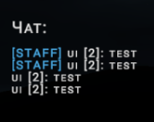

# Чат-система

На сервере доступен собственный внутриигровой текстовый чат.

<figure><figcaption></figcaption></figure>

### Как работает чат

Сообщения живых игроков являются **локальными**: их видят только другие живые игроки, находящиеся в радиусе **20 юнитов** от отправителя.

Мёртвые игроки видят **все сообщения**, независимо от расстояния между игроками.

### Intercom

Если живой игрок отправляет сообщение, находясь внутри **Intercom**, оно транслируется **всем игрокам на сервере**, независимо от их местоположения.

Таким образом, Intercom можно использовать не только для голосовых объявлений, но и для глобальной передачи сообщений через текстовый чат.

### Отправка сообщения

Команда:

`.chat <сообщение>`

Также доступны:

`.text <сообщение>`\
`.send <сообщение>`\
`.чат <сообщение>`

### Ограничения

* обычные сообщения живых игроков видны в радиусе **20 юнитов**;
* мёртвые игроки видят сообщения со всей карты;
* сообщения из Intercom видны всем;
* максимальная длина сообщения — **100 символов**;
* между отправкой сообщений действует задержка.
